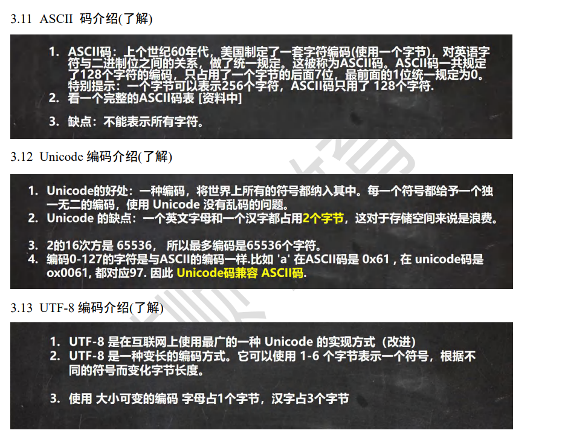
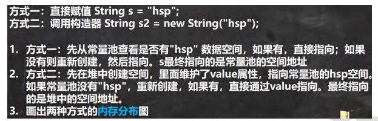
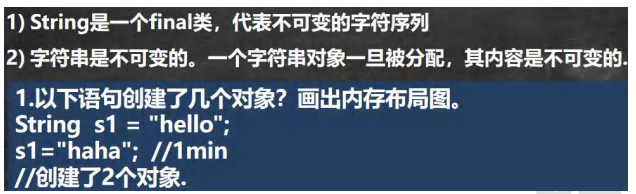
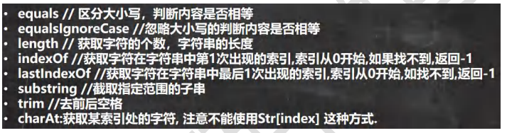
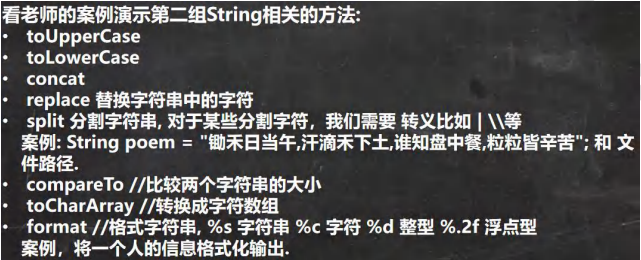
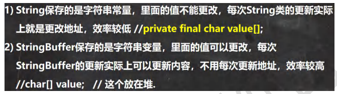
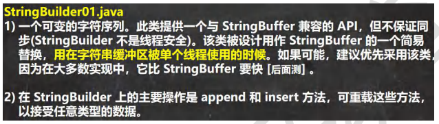
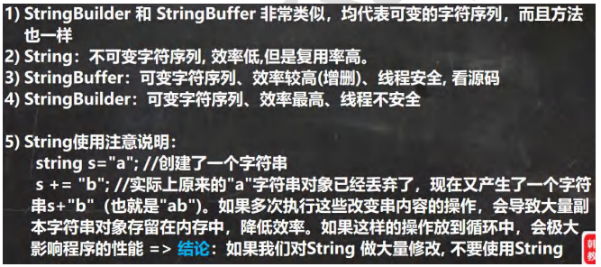
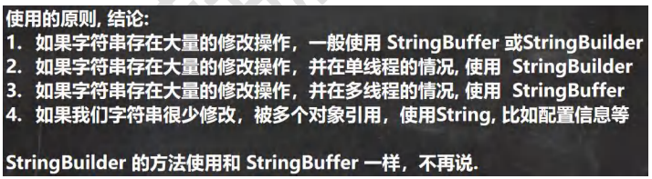
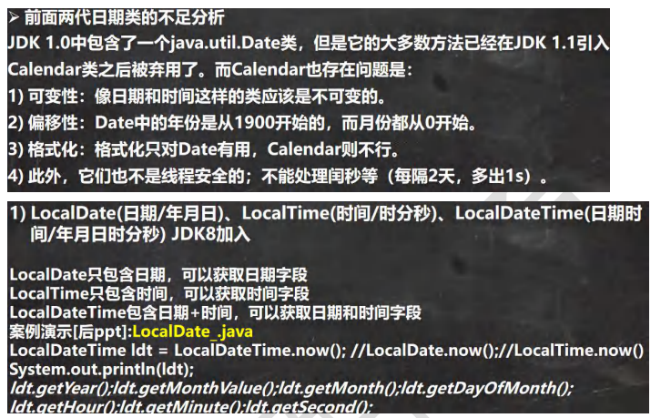

##### 基本数据类型

###### 浮点数的指数和尾数

指数（Exponent）：一个具体的整数值，取决于`3.1415926`的二进制近似表示。(1.xx... \* 2^exponent ≈ 3.1415926)

尾数（Mantissa）：一个很长的二进制数，表示小数部分（不包括隐含的 1 和整数部分）。由于`3.1415926`的小数部分在二进制中也是无限循环的，因此尾数将是一个近似值。

###### 浮点数比较大小

```
Math.abs(num11 - num12) < 0.000001
```

###### 字符类型编码



##### 包装类

###### Integer 类和 Character 类的常用方法

```
System.out.println(Integer.MIN_VALUE); //返回最小值
System.out.println(Integer.MAX_VALUE);//返回最大值
System.out.println(Character.isDigit('a'));//判断是不是数字
System.out.println(Character.isLetter('a'));//判断是不是字母
System.out.println(Character.isUpperCase('a'));//判断是不是大写
System.out.println(Character.isLowerCase('a'));//判断是不是小写
System.out.println(Character.isWhitespace('a'));//判断是不是空格
System.out.println(Character.toUpperCase('a'));//转成大写
System.out.println(Character.toLowerCase('A'));//转成小写
```

###### Integer 类面试题

```
1. 如果 i 在 IntegerCache.low(-128)~IntegerCache.high(127),就直接从数组返回
2. 如果不在 -128~127,就直接new
Integer i1 = new Integer(127);
Integer i2 = new Integer(127);
System.out.println(i1 == i2);//F
Integer i5 = 127;//底层 Integer.valueOf(127)
Integer i6 = 127;//-128~127
System.out.println(i5 == i6); //T
```

##### String 类

```
String 对象用于保存字符串，也就是一组字符序列
"jack" 字符串常量, 双引号括起的字符序列
字符串的字符使用 Unicode 字符编码，一个字符(不区分字母还是汉字)占两个字节//4. String 类有很多构造器，构造器的重载
    // 常用的有 String s1 = new String(); 
    //String s2 = new String(String original);
    //String s3 = new String(char[] a);
    //String s4 = new String(char[] a,int startIndex,int count)
    //String s5 = new String(byte[])
String 类实现了接口 Serializable【String 可以串行化:可以在网络传输】
接口 Comparable [String 对象可以比较大小]
String 是 final 类，不能被其他的类继承
String 有属性 private final char value[]; 用于存放字符串内容
一定要注意：value 是一个 final 类型， 不可以修改(需要功力)：即 value 不能指向// 新的地址，但是单个字符内容是可以变化
```



###### 字符串的特性



###### String 类的常见方法





```
startsWith、endsWith
```

##### StringBuffer 类

```
StringBuffer 的直接父类 是 AbstractStringBuilder
StringBuffer 实现了 Serializable, 即 StringBuffer 的对象可以串行化
在父类中 AbstractStringBuilder 有属性 char[] value,不是 final
该 value 数组存放 字符串内容，引出存放在堆中的
StringBuffer 是一个 final 类，不能被继承
因为 StringBuffer 字符内容是存在 char[] value, 所有在变化(增加/删除)
不用每次都更换地址(即不是每次创建新对象)， 所以效率高于 String
```



###### String 和 StringBuffer 相互转换

```
看 String——>StringBuffer
String str = "hello tom";
    //方式 1 使用构造器
    //注意： 返回的才是 StringBuffer 对象，对 str 本身没有影响
    StringBuffer stringBuffer = new StringBuffer(str);
    //方式 2 使用的是 append 方法
    StringBuffer stringBuffer1 = new StringBuffer();
    stringBuffer1 = stringBuffer1.append(str);
看看 StringBuffer ->String
    StringBuffer stringBuffer3 = new StringBuffer("韩顺平教育");
    //方式 1 使用 StringBuffer 提供的 toString 方法
    String s = stringBuffer3.toString();
    //方式 2: 使用构造器来搞定
    String s1 = new String(stringBuffer3);
```

###### StringBuffer 类常见方法

```
StringBuffer s = new StringBuffer("hello");
//增
    s.append(',');// "hello,"
    s.append("张三丰");//"hello,张三丰"
    s.append("赵敏").append(100).append(true).append(10.5);//"hello,张三丰赵敏 100true10.5" 	System.out.println(s);//"hello,张三丰赵敏 100true10.5"
//删
/*
* 删除索引为>=start && <end 处的字符
* 解读: 删除 11~1	4 的字符 [11, 14)
*/
    s.delete(11, 14);
    System.out.println(s);//"hello,张三丰赵敏 true10.5"
//改
//老韩解读，使用 周芷若 替换 索引 9-11 的字符 [9,11)
    s.replace(9, 11, "周芷若");
    System.out.println(s);//"hello,张三丰周芷若 true10.5"
    //查找指定的子串在字符串第一次出现的索引，如果找不到返回-1
    int indexOf = s.indexOf("张三丰");
    System.out.println(indexOf);//6
//插
老韩解读，在索引为 9 的位置插入 "赵敏",原来索引为 9 的内容自动后移
    s.insert(9, "赵敏");
    System.out.println(s);//"hello,张三丰赵敏周芷若 true10.5"
    //长度
    System.out.println(s.length());//22
    System.out.println(s);
```

##### StringBuilder 类



###### String、StringBuffer 和 StringBuilder 的比较



###### String、StringBuffer 和 StringBuilder 的选择



##### Math 类

Math 类包含用于执行基本数学运算的方法，如初等指数、对数、平方根和三角函数

##### BigInteger 和 BigDecimal 类

##### 日期类型



```
//第三代日期
//老韩解读
//1. 使用 now() 返回表示当前日期时间的 对象
    LocalDateTime ldt = LocalDateTime.now(); //LocalDate.now();//LocalTime.now()
    System.out.println(ldt);
//2. 使用 DateTimeFormatter 对象来进行格式化
// 创建 DateTimeFormatter 对象
    DateTimeFormatter dateTimeFormatter = DateTimeFormatter.ofPattern("yyyy-MM-dd HH:mm:ss");
    String format = dateTimeFormatter.format(ldt);
    System.out.println("格式化的日期=" + format);
    System.out.println("年=" + ldt.getYear());
    System.out.println("月=" + ldt.getMonth());
    System.out.println("月=" + ldt.getMonthValue());
    System.out.println("日=" + ldt.getDayOfMonth());
    System.out.println("时=" + ldt.getHour());
    System.out.println("分=" + ldt.getMinute());
    System.out.println("秒=" + ldt.getSecond());
    LocalDate now = LocalDate.now(); //可以获取年月日
LocalTime now2 = LocalTime.now();//获取到时分秒
//提供 plus 和 minus 方法可以对当前时间进行加或者减
//看看 890 天后，是什么时候 把 年月日-时分秒
LocalDateTime localDateTime = ldt.plusDays(890);
System.out.println("890 天后=" + dateTimeFormatter.format(localDateTime));
//看看在 3456 分钟前是什么时候，把 年月日-时分秒输出
LocalDateTime localDateTime2 = ldt.minusMinutes(3456);
System.out.println("3456 分钟前 日期=" + dateTimeFormatter.format(localDateTime2));
```

###### Instant 时间戳

```
通过 静态方法 now() 获取表示当前时间戳的对象
    Instant now = Instant.now();
    System.out.println(now);
通过 from 可以把 Instant 转成 Date
    Date date = Date.from(now);
    通过 date 的 toInstant() 可以把 date 转成 Instant 对象
    Instant instant = date.toInstant();
```

