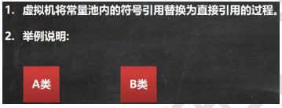

##### 访问修饰符

基本介绍 java 提供四种访问控制修饰符号，用于控制方法和属性(成员变量)的访问权限（范围）:

公开级别:用 public 修饰,对外公开

受保护级别:用 protected 修饰,对**子类和同一个包**中的类公开

默认级别:没有修饰符号,向同一个包的类公开.

私有级别:用 private 修饰,只有类本身可以访问,不对外公开


##### 多态

向上转型调用方法的规则如下:

可以调用父类中的所有成员(需遵守访问权限)

但是不能调用子类的特有的成员

编译看左边，运行看右边

##### Object 类的方法

finalize 方法

当对象被回收时，系统自动调用该对象的 finalize 方法。子类可以重写该方法，做一些释放资源的操作

什么时候被回收：当某个对象没有任何引用时，则 jvm 就认为这个对象是一个垃圾对象，就会使用垃圾回收机制来销毁该对象，在销毁该对象前，会先调用 finalize 方法。

垃圾回收机制的调用，是由系统来决定(即有自己的 GC 算法), 也可以通过 System.gc() 主动触发垃圾回收机制

##### 代码块

代码块调用的顺序优先于构造器

##### 内部类

如果定义类在局部位置(方法中/代码块) :

```
(1) 局部内部类 (2) 匿名内部类 定义在成员位置 (1) 成员内部类 (2) 静态内部类
```

基本介绍


###### 局部内部类的使用


###### 匿名内部类的使用(重要!!!!!!!)


###### 成员内部类的使用


//外部其他类，使用成员内部类的三种方式

第一种方式

outer08.new Inner08(); 相当于把 new Inner08()当做是 outer08 成员 Outer08.Inner08 inner08 = outer08.new Inner08(); inner08.say();

第二方式

在外部类中，编写一个方法，可以返回 Inner08 对象 Outer08.Inner08 inner08Instance = outer08.getInner08Instance(); inner08Instance.say();

###### 静态内部类的使用


方式 1

因为静态内部类，是可以通过类名直接访问(前提是满足访问权限) Outer10.Inner10 inner10 = new Outer10.Inner10(); inner10.say();

方式 2

编写一个方法，可以返回静态内部类的对象实例. Outer10.Inner10 inner101 = outer10.getInner10(); inner101.say();

##### 反射

```
使用反射机制解决
//(1) 加载类, 返回 Class 类型的对象 cls
Class cls = Class.forName(classfullpath);
//(2) 通过 cls 得到你加载的类 com.hspedu.Cat 的对象实例
Object o = cls.newInstance();
System.out.println("o 的运行类型=" + o.getClass()); //运行类型
//(3) 通过 cls 得到你加载的类 com.hspedu.Cat 的 methodName"hi" 的方法对象// 即：在反射中，可以把方法视为对象（万物皆对象）
Method method1 = cls.getMethod(methodName);
//(4) 通过 method1 调用方法: 即通过方法对象来实现调用方法
System.out.println("=============================");
method1.invoke(o); //传统方法 对象.方法() , 反射机制 方法.invoke(对象)
```


###### Java 反射机制原理示意图!!!


###### Java 反射机制可以完成


###### 反射相关的主要类


###### 反射调用优化-关闭访问检查


```
本质上，就是找jvm要一个对象，一个直接 new ，一个通过类路径获取Class类型的对象去getInstanst
```

###### Class 类


###### Class 类的常用方法


##### 类加载


###### 类加载时机


###### 类加载过程图


###### 类加载各阶段完成任务


###### 加载阶段


###### 连接阶段-验证


###### 连接阶段-准备


###### 连接阶段-解析



###### Initialization（初始化)


###### 通过反射获取类的结构信息


###### 通过反射创建对象


###### 通过反射访问类中的成员


###### 访问方法 ReflecAccessMethod.java


