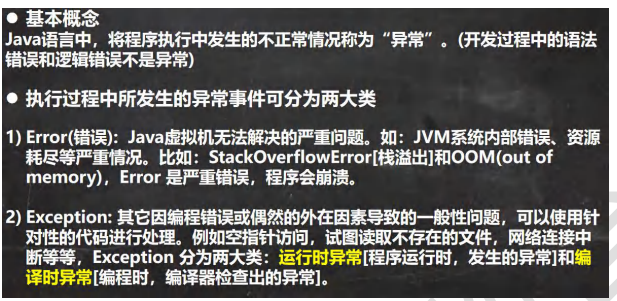
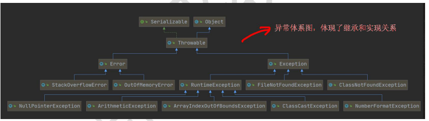
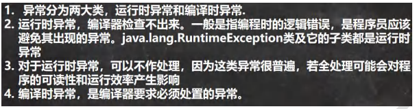
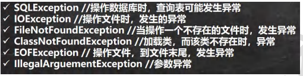

##### 异常-Exception



###### 异常体系图一览





###### 常见的运行时异常

```
1) NullPointerException 空指针异常
2) ArithmeticException 数学运算异常
3) ArrayIndexOutOfBoundsException 数组下标越界异常
4) ClassCastException 类型转换异常
5) NumberFormatException 数字格式不正确异常[]
```

###### 编译异常

编译异常是指在编译期间，就必须处理的异常，否则代码不能通过编译



###### 异常处理

```
1. 如果异常发生了，则异常发生后面的代码不会执行，直接进入到 catch 块
2. 如果异常没有发生，则顺序执行 try 的代码块，不会进入到 catch
3. 如果希望不管是否发生异常，都执行某段代码(比如关闭连接，释放资源等)则使用如下代码- finally
1.如果 try 代码块有可能有多个异常
2.可以使用多个 catch 分别捕获不同的异常，相应处理
//3.要求子类异常写在前面，父类异常写在后面
```
