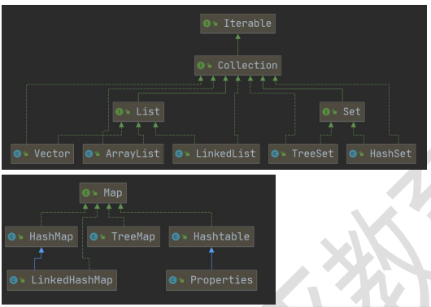
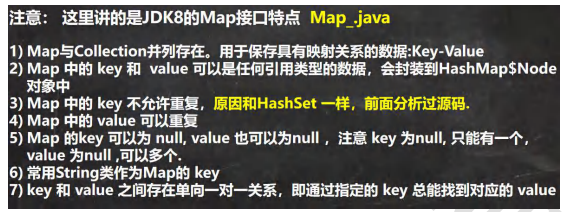

##### 数组

动态初始化、静态初始化

##### Arrays 类

###### Arrays 类常见方法应用案例


###### System.arraycopy

```
主要是搞清楚这五个参数的含义
src:源数组
srcPos:从源数组的哪个索引位置开始拷贝
dest:目标数组，即把源数组的数据拷贝到哪个数组
destPos:把源数组的数据拷贝到 目标数组的哪个索引
length: 从源数组拷贝多少个数据到目标数组
System.arraycopy(src, 0, dest, 0, src.length);
```

##### 集合

###### 集合的框架体系

```
集合主要是两组(单列集合 , 双列集合)
Collection 接口有两个重要的子接口 List Set , 他们的实现子类都是单列集合
Map 接口的实现子类 是双列集合，存放的 K-V
```



###### Iterator、普通for、增强for

#####  List 接口和常用方法

###### ArrayList 底层结构和源码分析


###### Vector 底层结构和源码剖析


###### Vector 和 ArrayList 的比较


###### LinkedList 底层结构


###### ArrayList 和 LinkedList 比较


##### Set 接口和常用方法


###### HashSet 底层机制说明

元素无序、不可重复，无索引


###### Set 接口实现类-LinkedHashSet


##### Map 接口和常用方法




###### Map 接口实现类-HashMap


###### HashMap 底层机制及源码剖析


###### HashTable 的基本介绍


###### Map 接口实现类-Properties


```
//1. Properties 继承 Hashtable
//2. 可以通过 k-v 存放数据，当然 key 和 value 不能为 null
//增加
Properties properties = new Properties();
//properties.put(null, "abc");//抛出 空指针异常
//properties.put("abc", null); //抛出 空指针异常
properties.put("john", 100);//k-v
properties.put("lucy", 100);
properties.put("lic", 100);
properties.put("lic", 88);//如果有相同的 key ， value 被替换
System.out.println("properties=" + properties);
//通过 k 获取对应值
System.out.println(properties.get("lic"));//88
//删除
properties.remove("lic");
System.out.println("properties=" + properties);
//修改
properties.put("john", "约翰");
System.out.println("properties=" + properties)
```

###### 总结-开发中如何选择集合实现类(记住)


```
TreeSet、TreeMap有序特殊情况
//使用默认的构造器，创建 TreeMap, 是无序的(也没有排序)
/*
老韩要求：按照传入的 k(String) 的大小进行排序
*/
// TreeMap treeMap = new TreeMap();
TreeMap treeMap = new TreeMap(new Comparator() {
@Override
public int compare(Object o1, Object o2) {
//按照传入的 k(String) 的大小进行排序
//按照 K(String) 的长度大小排序
//return ((String) o2).compareTo((String) o1);
return ((String) o2).length() - ((String) o1).length();
}
});
treeMap.put("jack", "杰克");
treeMap.put("tom", "汤姆");
treeMap.put("kristina", "克瑞斯提诺");
treeMap.put("smith", "斯密斯");
treeMap.put("hsp", "韩顺平");//加入不了
```

##### Collections 工具类


##### Properties 类


```
//1. 创建 Properties 对象
Properties properties = new Properties();
//2. 加载指定配置文件
properties.load(new FileReader("src\\mysql.properties"));
//3. 把 k-v 显示控制台
properties.list(System.out);
//4. 根据 key 获取对应的值
String user = properties.getProperty("user");
String pwd = properties.getProperty("pwd");
System.out.println("用户名=" + user);
System.out.println("密码是=" + pwd)
properties.setProperty("charset", "utf8");
properties.setProperty("user", "汤姆");//注意保存时，是中文的 unicode 码值
properties.setProperty("pwd", "888888");
//将 k-v 存储文件中即可
properties.store(new FileOutputStream("src\\mysql2.properties"), null);
```


