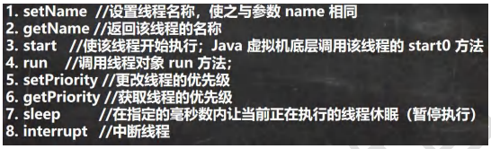
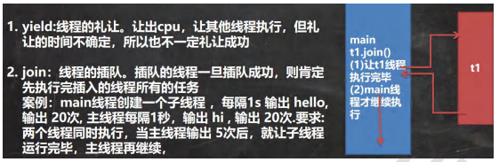
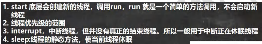
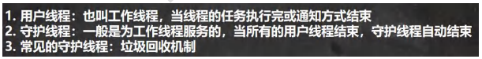
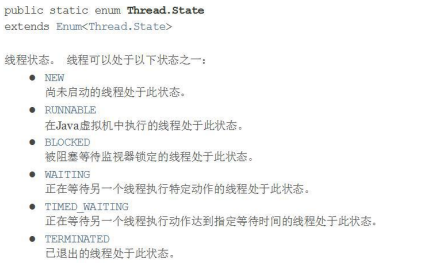
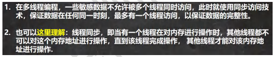
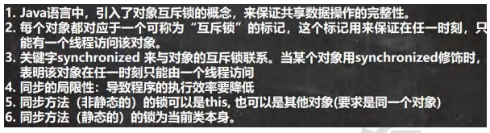
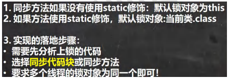
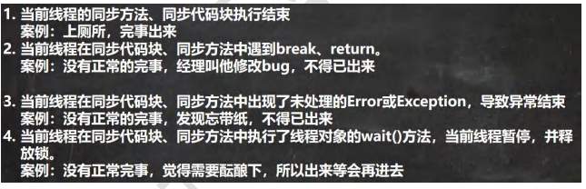
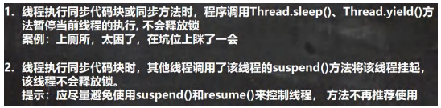

###### 线程基本使用

###### 线程常用方法





###### 注意事项和细节



###### 用户线程和守护线程



###### 线程的生命周期




###### 线程的同步Synchronized



###### 互斥锁



```
public synchronized void sell() {} 就是一个同步方法
这时锁在 this 对象
也可以在代码块上写 synchronize ,同步代码块, 互斥锁还是在 this 对象
```

###### 注意事项和细节



##### 线程的死锁


###### 释放锁





