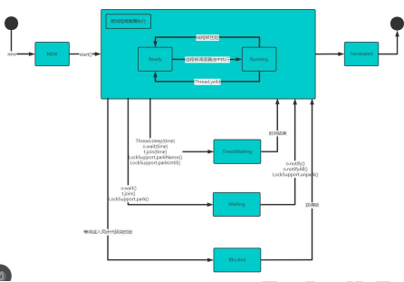

###### 线程基本使用

###### 线程常用方法


###### 注意事项和细节


###### 用户线程和守护线程


###### 线程的生命周期




###### 线程的同步Synchronized


###### 互斥锁


```
public synchronized void sell() {} 就是一个同步方法
这时锁在 this 对象
也可以在代码块上写 synchronize ,同步代码块, 互斥锁还是在 this 对象
```

###### 注意事项和细节


##### 线程的死锁


###### 释放锁


