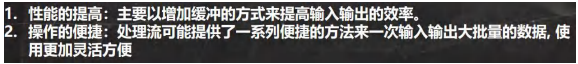

###### 获取文件的相关信息


###### 目录的操作和文件删除


###### 流的分类


###### IO 流体系图-常用的类


##### 节点流和处理流

###### 节点流和处理流的区别和联系


###### 处理流的功能主要体现在以下两个方面:



```
处理流-BufferedInputStream 和 BufferedOutputStream
处理流-BufferedReader 和 BufferedWriter
```

###### 对象流-ObjectInputStream 和 ObjectOutputStream


###### 标准输入输出流


###### 转换流-InputStreamReader 和 OutputStreamWriter


###### 打印流-PrintStream 和 PrintWriter


