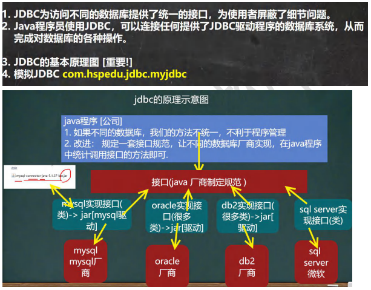
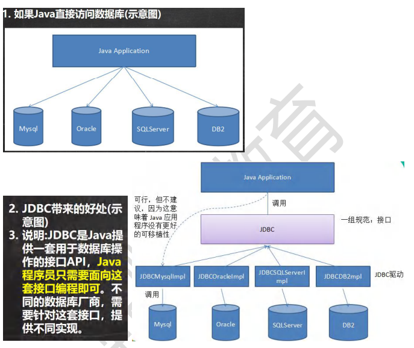
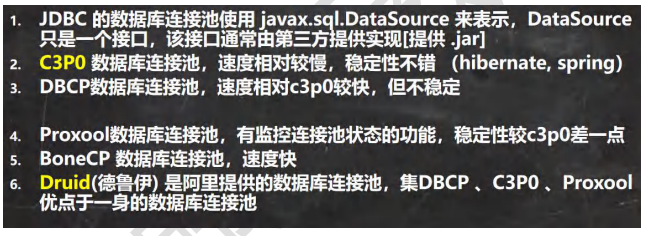
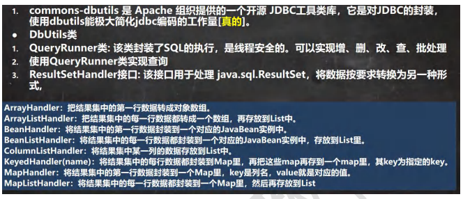

######  JDBC 程序编写步骤


```
//前置工作： 在项目下创建一个文件夹比如 libs
// 将 mysql.jar 拷贝到该目录下，点击 add to project ..加入到项目中
//1. 注册驱动
Driver driver = new Driver(); //创建 driver 对象
//2. 得到连接
String url = "jdbc:mysql://localhost:3306/hsp_db02";
//将 用户名和密码放入到 Properties 对象
Properties properties = new Properties();
//说明 user 和 password 是规定好，后面的值根据实际情况写
properties.setProperty("user", "root");// 用户
properties.setProperty("password", "hsp"); //密码

Connection connect = driver.connect(url, properties);

//3. 执行 sql
//String sql = "insert into actor values(null, '刘德华', '男', '1970-11-11', '110')";
//String sql = "update actor set name='周星驰' where id = 1";
String sql = "delete from actor where id = 1";
//statement 用于执行静态 SQL 语句并返回其生成的结果的对象
Statement statement = connect.createStatement();
int rows = statement.executeUpdate(sql); // 如果是 dml 语句，返回的就是影响行数System.out.println(rows > 0 ? "成功" : "失败");
//4. 关闭连接资源
statement.close();
connect.close();
```

###### ResultSet[结果集]

```
ResultSet resultSet = statement.executeQuery(sql);
```

```
connection.setAutoCommit(false); //开启了事务
```

```
preparedStatement.executeBatch();//批处理
```

###### 数据库连接池


###### 数据库连接池种类



```
//1. 加入 Druid jar 包
//2. 加入 配置文件 druid.properties , 将该文件拷贝项目的 src 目录
//3. 创建 Properties 对象, 读取配置文件
Properties properties = new Properties();
properties.load(new FileInputStream("src\\druid.properties"));
//4. 创建一个指定参数的数据库连接池, Druid 连接池
DataSource dataSource = DruidDataSourceFactory.createDataSource(properties);
long start = System.currentTimeMillis();
for (int i = 0; i < 500000; i++) {
Connection connection = dataSource.getConnection();
System.out.println(connection.getClass());
//System.out.println("连接成功!");
connection.close();
}
long end = System.currentTimeMillis();
//druid 连接池 操作 5000 耗时=412
System.out.println("druid 连接池 操作 500000 耗时=" + (end - start));//539
}
```



