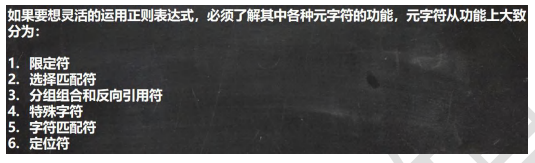
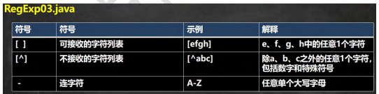
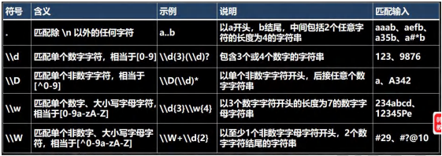
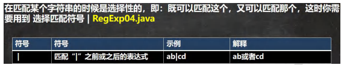
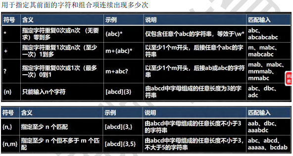

```
//1. 先创建一个 Pattern 对象 ， 模式对象, 可以理解成就是一个正则表达式对象
//Pattern pattern = Pattern.compile("[a-zA-Z]+");
//Pattern pattern = Pattern.compile("[0-9]+");
//Pattern pattern = Pattern.compile("([0-9]+)|([a-zA-Z]+)");
//Pattern pattern = Pattern.compile("<a target=\"_blank\" title=\"(\\S*)\"")
```

###### 正则表达式语法



###### 元字符-字符匹配符





###### 元字符-选择匹配符



###### 元字符-限定符



###### 元字符-定位符
