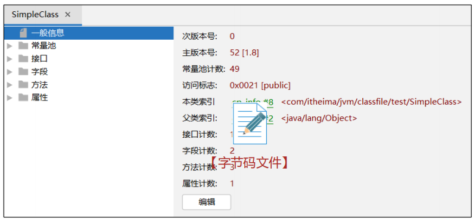
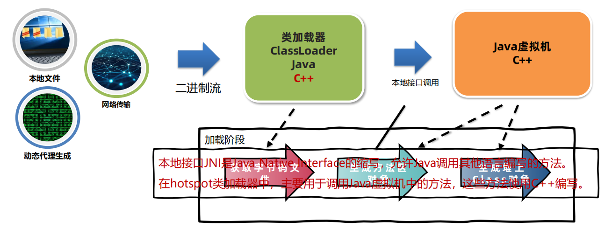

###### Java 核心机制-Java 虚拟机 [JVM java virtual machine]

https://lisxpq12rl7.feishu.cn/wiki/F2AFw0doOiW89Fkr8kGcCTyVnLh


基本介绍

1) JVM 是一个虚拟的计算机，具有指令集并使用不同的存储区域。负责执行指令，管理数据、内存、寄存器，包含在

JDK 中. 

2) 对于不同的平台，有不同的虚拟机。

3) Java 虚拟机机制屏蔽了底层运行平台的差别，实现了“一次编译，到处运行” 

   ```
   解释和运行、内存管理、即时编译
   ```

###### 字节码文件详解      




#####    类的声明周期   

###### 加载


```
HsdbDemo对象包含InstanceKlass对象，InstanceKlass对象包含Class对象
```

###### 连接

验证-》准备-》解析      


###### 初始化

```
以下几种方式会导致类的初始化：
1.访问一个类的静态变量或者静态方法，注意变量是final修饰的并且等号右边是常量不会触发初始化。
2.调用Class.forName(String className)。
3.new一个该类的对象时。
4.执行Main方法的当前类
```

##### ClassLoader类加载器

类加载器（ClassLoader）是Java虚拟机提供给应用程序去实现获取类和接口字节码数据的技术。

类加载器只参与加载过程中的字节码获取并加载到内存这一部分。



###### 分类


```
启动类加载器（BootstrapClassLoader）是由Hotspot虚拟机提供的、使用C++编写的类加载器。默认加载Java安装目录/jre/lib下的类文件，比如rt.jar
```

###### 通过启动类或者扩展类加载器去加载用户jar包：

```0000000000000000000000000000000
使用参数进行扩展
推荐，使用-Xbootclasspath/a:jar包目录/jar包名进行扩展
推荐，使用-Djava.ext.dirs=jar包目录进行扩展,这种方式会覆盖掉原始目录，可以用;(windows):(macos/linux)追加上原始目录
```

######   类的双亲委派机制

```
向上查找，向下加载
- 当一个类加载器去加载某个类的时候，会自底向上查找是否加载过，如果加载过就直接返回，如果一直到最顶层的类加载器都没有加载，再由顶向下进行加载。
- 应用程序类加载器的父类加载器是扩展类加载器，扩展类加载器的父类加载器是启动类加载器。
- 双亲委派机制的好处有两点：第一是避免恶意代码替换JDK中的核心类库，比如java.lang.String，确保核心类库的完整性和安全性。第二是避免一个类重复地被加载。
```

   
