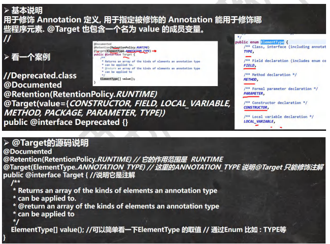
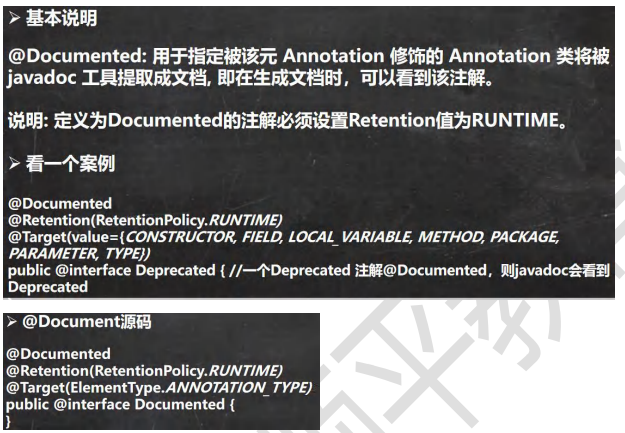

##### 枚举

枚举对应英文(enumeration, 简写 enum)

枚举是一组常量的集合。

可以这里理解：枚举属于一种特殊的类，里面只包含一组有限的特定的对象。

###### 自定义类实现枚举

```
构造器私有化

本类内部创建一组对象[四个 春夏秋冬]

对外暴露对象（通过为对象添加 public final static 修饰符）

可以提供 get 方法，但是不要提供 set
```

###### enum 关键字实现枚举

如果使用了 enum 来实现枚举类

1. 使用关键字 enum 替代 class
2. public static final Season SPRING = new Season("春天", "温暖") 直接使用 // SPRING("春天", "温暖") 解读 常量名(实参列表)
3. 如果有多个常量(对象)， 使用 ,号间隔即可
4. 如果使用 enum 来实现枚举，要求将定义常量对象，写在前面
5. 如果我们使用的是无参构造器，创建常量对象，则可以省略 () SPRING("春天", "温暖"), WINTER("冬天", "寒冷"), AUTUMN("秋天", "凉爽"), SUMMER("夏天", "炎热")

###### enum 关键字实现枚举注意事项

当我们使用 enum 关键字开发一个枚举类时，默认会继承 Enum 类, 而且是一个 final 类[如何证明],老师使用 javap 工具来演示

传统的 public static final Season2 SPRING = new Season2("春天", "温暖"); 简化成 SPRING("春天", "温暖")，这里必须知道，它调用的是哪个构造器.

如果使用无参构造器 创建 枚举对象，则实参列表和小括号都可以省略

当有多个枚举对象时，使用,间隔，最后有一个分号结尾，枚举对象必须放在枚举类的行首.

###### enum 常用的方法的使用

toString:Enum 类已经重写过了，返回的是当前对象 名,子类可以重写该方法，用于返回对象的属性信息

name：返回当前对象名（常量名），子类中不能重写

ordinal：返回当前对象的位置号，默认从 0 开始

values：返回当前枚举类中所有的常量

valueOf：将字符串转换成枚举对象，要求字符串必须 为已有的常量名，否则报异常！

compareTo：比较两个枚举常量，比较的就是编号！

##### 注解

###### 注解的理解

注解(Annotation)也被称为元数据(Metadata)，用于修饰解释 **包、类、方法、属性、构造器、局部变量**等数据信息。

和注释一样，注解不影响程序逻辑，但**注解可以被编译或运行**，相当于嵌入在代码中的补充信息。

在 JavaSE 中，注解的使用目的比较简单，例如标记过时的功能，忽略警告等。在 JavaEE 中注解占据了更重要的角色，例如用来配置应用程序的任何切面，代替 java EE 旧版中所遗留的繁冗代码和 XML 配置等。

###### 基本的 Annotation 介绍

使用 Annotation 时要在其前面增加 @ 符号, 并把该 Annotation 当成一个修饰符使用。用于修饰它支持的程序元素 三个基本的 Annotation: 1) @Override: 限定某个方法，是重写父类方法, 该注解只能用于方法 2) @Deprecated: 用于表示某个程序元素(类, 方法等)已过时 3) @SuppressWarnings: 抑制编译器警告

###### JDK 的元 Annotation(元注解， 了解)

Retention //指定注解的作用范围，三种 SOURCE,CLASS,RUNTIME

Target // 指定注解可以在哪些地方使用

Documented //指定该注解是否会在 javadoc 体现

Inherited //子类会继承父类注解

@Retention 注解

```
只能用于修饰一个 Annotation 定义, 用于指定该 Annotation 可以保留多长时间, @Rentention 包含一个RetentionPolicy类型的成员变量, 使用 @Rentention 时必须为该 value 成员变量指定值: @Retention 的三种值
1) RetentionPolicy.SOURCE: 编译器使用后，直接丢弃这种策略的注释
2) RetentionPolicy.CLASS: 编译器将把注解记录在 class 文件中. 当运行 Java 程序时, JVM 不会保留注解。这是默认值
3) RetentionPolicy.RUNTIME:编译器将把注解记录在 class 文件中. 当“运行 Java 程序时”, JVM会保留注解. 程序可以通过反射获取该注解
```

@Target



@Documented



@Inherited 注解


