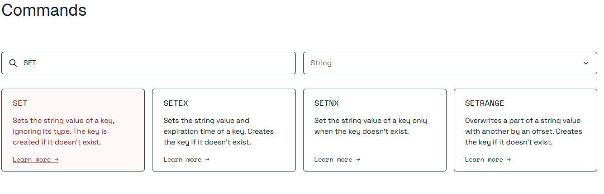

###### 常用命令

[命令 |文档 (redis.io)](https://redis.io/docs/latest/commands/)

```bash
help @xx类型
```



###### String类型

最大value现在512MB

###### 应用较多的功能

- 唯一setnx
- 先get再set
- incr /decr:点赞功能、购物车数量、文章阅读量
- list类型下标插入
- set集合操作（交集、并集、差集）:共同朋友、抽奖不重复的工号
- zset是有序的set类型，score排序:排行榜
- bitmap:签到考勤 

##### springboot整合

###### redisTemplate

```

```

```

```

###### 方式2Jedis

```xml
<dependency>
    <groupId>redis.clients</groupId>
    <artifactId>jedis</artifactId>
    <version>4.3.1</version>
</dependency>
```

```java
package com.atguigu.redis7.demo;

import org.springframework.stereotype.Component;
import redis.clients.jedis.Jedis;

import java.util.List;
import java.util.Set;

/**
 * @auther zzyy
 * @create 2022-12-13 20:12
 */

public class JedisDemo
{
    public static void main(String[] args)
    {
        //1 connection获得，通过指定ip和端口号
        Jedis jedis = new Jedis("192.168.111.185", 6379);
        //2 指定访问服务器的密码
        jedis.auth("111111");
        //3 获得了jedis客户端，可以像jdbc一样，访问我们的redis
        System.out.println(jedis.ping());

        //keys
        Set<String> keys = jedis.keys("*");
        System.out.println(keys);

        //string
        jedis.set("k3","hello-jedis");
        System.out.println(jedis.get("k3"));
        System.out.println(jedis.ttl("k3"));
        jedis.expire("k3",20L);

        //list
        jedis.lpush("list","11","12","13");
        List<String> list = jedis.lrange("list", 0, -1);
        for (String element : list) {
            System.out.println(element);
        }
        //家庭作业

    }
}
```

###### 方式3lettuce

```xml
<dependency>
    <groupId>io.lettuce</groupId>
    <artifactId>lettuce-core</artifactId>
    <version>6.2.1.RELEASE</version>
</dependency>
```

```java
package com.atguigu.redis7.demo;


import io.lettuce.core.RedisClient;
import io.lettuce.core.RedisURI;
import io.lettuce.core.api.StatefulRedisConnection;
import io.lettuce.core.api.sync.RedisCommands;

import java.util.List;
import java.util.stream.Stream;

/**
 * @auther zzyy
 * @create 2022-12-13 20:39
 */
public class LettuceDemo
{
    public static void main(String[] args)
    {
        // 1 使用构建器链式编程来builder我们RedisURI
        RedisURI uri = RedisURI.builder()
                .redis("192.168.111.185")
                .withPort(6379)
                .withAuthentication("default","111111")
                .build();

        //2 创建连接客户端
        RedisClient redisClient = RedisClient.create(uri);
        StatefulRedisConnection conn = redisClient.connect();

        //3 通过conn创建操作的command
        RedisCommands commands = conn.sync();

        //========biz====================
        //keys
        List keys = commands.keys("*");
        System.out.println("***********"+keys);

        //string
        commands.set("k5","hello-lettuce");
        System.out.println("***********"+commands.get("k5"));
        //....

        //========biz====================

        //4 各种关闭释放资源
        conn.close();
        redisClient.shutdown();
    }
}
```

###### 