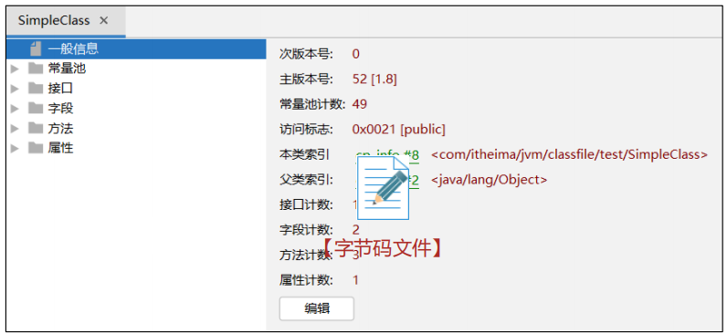

###### jclasslib

```
用于查看字节码文件，可以下载安装，可以使用idea插件
```



###### arthas https://arthas.aliyun.com/doc/commands.html

```
用于针对运行在虚拟机上的java程序的监控、下载字节码文件和反编译
```

###### hsdb工具

```
推荐使用 JDK自带的hsdb工具查看Java虚拟机内存信息。工具位于JDK安装目录下lib文件夹中的sa-jdi.jar中。
⚫启动命令：java -cp sa-jdi.jar sun.jvm.hotspot.HSDB
```

